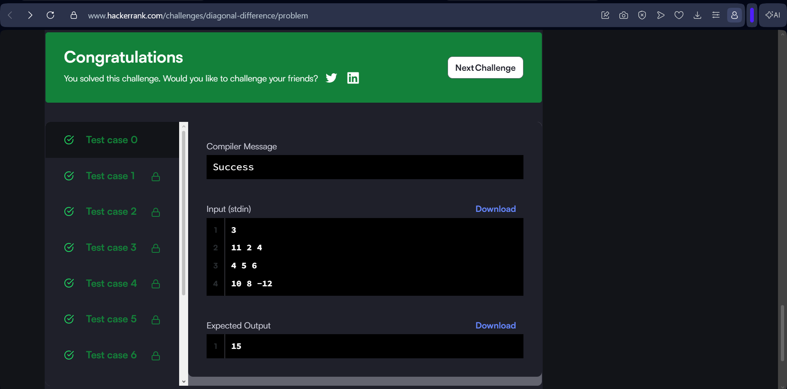
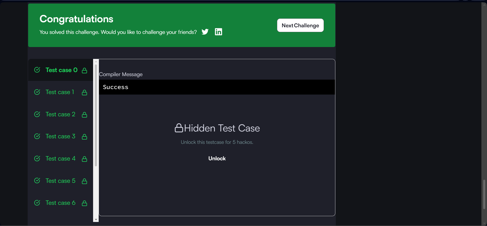
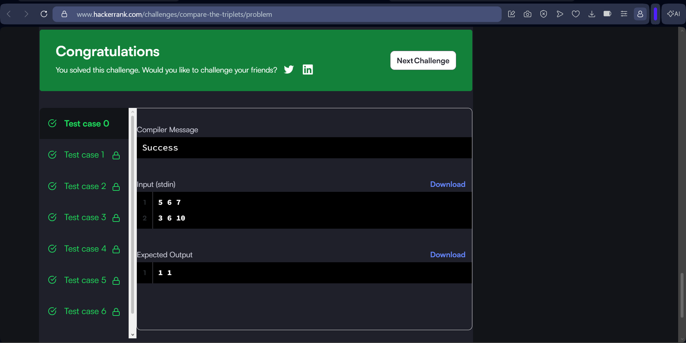
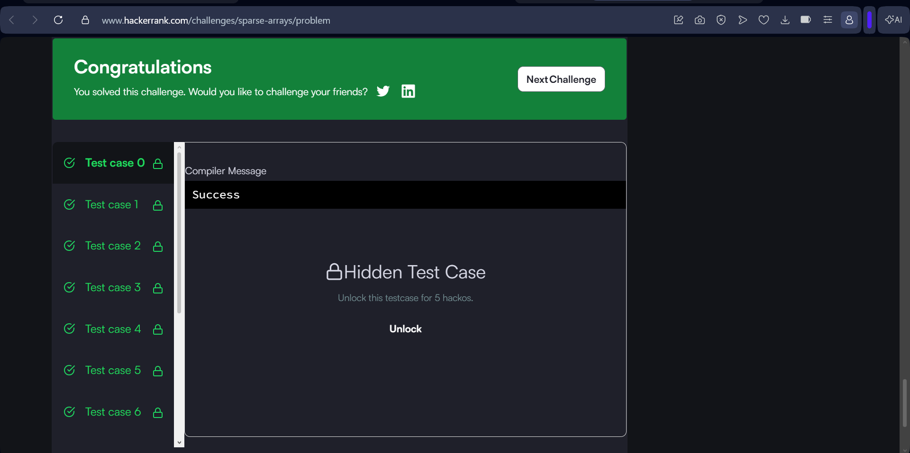

# HackerRank 3rd Semester Portfolio

## Overview

This repository contains my solutions to the mandatory HackerRank algorithmic problem-solving challenges for the 3rd Semester B.Tech CSE Studio Activity.

All solutions are implemented in Java 8 with a focus on clean code, efficient algorithms, and appropriate time and space complexity.

---

## HackerRank Profile

HackerRank Profile:  
https://www.hackerrank.com/profile/omsai2k7

---

## Programming Language

- Java 8

---

## Repository Structure

```text
HackerRank-3rdSem-Portfolio/
│
├── Diagonal-Difference/
│   └── Solution.java
│
├── Dynamic-Array/
│   └── Solution.java
│
├── Time-Conversion/
│   └── Solution.java
│
├── Compare-the-Triplets/
│   └── Solution.java
│
├── Sparse-Arrays/
│   └── Solution.java
│
└── README.md

---

## Solved HackerRank Problems

### 1. Diagonal Difference

Time Complexity: `O(N)`  
Space Complexity: `O(1)`

HackerRank:  
https://www.hackerrank.com/challenges/diagonal-difference/problem

### 2. Dynamic Array

Time Complexity: `O(N + Q)`  
Space Complexity: `O(N)`

HackerRank:  
https://www.hackerrank.com/challenges/dynamic-array/problem

### 3. Time Conversion

Time Complexity: `O(1)`  
Space Complexity: `O(1)`

HackerRank:  
https://www.hackerrank.com/challenges/time-conversion/problem

### 4. Compare the Triplets

Time Complexity: `O(1)`  
Space Complexity: `O(1)`

HackerRank:  
https://www.hackerrank.com/challenges/compare-the-triplets/problem

### 5. Sparse Arrays

Time Complexity: `O(N + Q)`  
Space Complexity: `O(N)`

HackerRank:  
https://www.hackerrank.com/challenges/sparse-arrays/problem

---

## Time & Space Complexity Summary

| Problem | Time Complexity | Space Complexity |
|---|---|---|
| Diagonal Difference | O(N) | O(1) |
| Dynamic Array | O(N + Q) | O(N) |
| Time Conversion | O(1) | O(1) |
| Compare the Triplets | O(1) | O(1) |
| Sparse Arrays | O(N + Q) | O(N) |

---

## HackerRank Submission Screenshots

### Diagonal Difference



### Dynamic Array



### Time Conversion


### Compare the Triplets



### Sparse Arrays



---

## HackerRank Badge

Badge screenshot will be added here after achieving the required badge level.

---

## Key Algorithmic Techniques

- Matrix traversal
- Array and list manipulation
- XOR-based indexing
- String processing
- Conditional logic
- HashMap-based frequency counting
- Efficient input/output handling
- Complexity analysis

---

## Learning Outcome

Through these problems, I practised selecting appropriate data structures and designing solutions according to the required time and space constraints. The exercises improved my understanding of efficient traversal, query processing, string manipulation, and frequency-based searching.

---

## Author

Omsai

B.Tech Computer Science & Engineering  
3rd Semester
