# HackerRank 3rd Sem Portfolio

This repository contains my 3rd Semester B.Tech CSE HackerRank Algorithmic Problem-Solving Portfolio, implemented using Java 8.

The portfolio demonstrates my ability to solve algorithmic problems, analyse time and space complexity, implement efficient solutions, and maintain a structured programming portfolio using GitHub.

## Important Links

GitHub Repository:
https://github.com/omsai2k7-wq/HackerRank-3rdSem-Portfolio

HackerRank Profile:
https://www.hackerrank.com/profile/omsai2k7

## Technology Used

Programming Language: Java 8

Platform: HackerRank

Repository Platform: GitHub

# Repository Structure

HackerRank-3rdSem-Portfolio/
│
├── Diagonal-Difference/
│   └── Solution.java
│
├── Dynamic-Array/
│   └── Solution.java
│
├── Time-Conversion/
│   └── Solution.java
│
├── Compare-the-Triplets/
│   └── Solution.java
│
├── Sparse-Arrays/
│   └── Solution.java
│
├── HR1.png
├── HR2.png
├── HR3.png
├── HR4.png
├── HR5.png
├── HR6.png
├── HR7.png
├── HR8.png
├── HR9.png
├── HR10.png
├── HR11.png
├── HR12.png
├── HR13.png
├── HR14.png
├── HR15.png
├── HR16.png
├── HR17.png
├── HR18.png
├── HR19.png
├── HR20.png
│
├── 3-Star-Badge.png
└── README.md

# HackerRank Problems

## 1. Diagonal Difference

The problem requires calculating the absolute difference between the sums of the two diagonals of a square matrix.

Implementation: Java 8

Approach:
The matrix is traversed once. During the traversal, the elements belonging to the primary diagonal are added to one sum, while the elements belonging to the secondary diagonal are added to another sum. The absolute difference between the two diagonal sums is then calculated.

Time Complexity: O(N)

Space Complexity: O(1)

HackerRank:
https://www.hackerrank.com/challenges/diagonal-difference/problem

Submission Screenshot:

## 2. Dynamic Array

The problem requires maintaining multiple dynamic sequences and processing queries that determine which sequence should be accessed or modified.

Implementation: Java 8

Approach:
An array of sequences is maintained. For each query, the sequence index is calculated using the query values and the current value of the last answer. Type-1 queries add an element to the selected sequence, while type-2 queries retrieve an element and update the last answer.

Time Complexity: O(N + Q)

Space Complexity: O(N)

HackerRank:
https://www.hackerrank.com/challenges/dynamic-array/problem

Submission Screenshot:

## 3. Time Conversion

The problem requires converting a time from the 12-hour AM/PM format into the 24-hour format.

Implementation: Java 8

Approach:
The input string is separated into the hour, minute, second, and AM/PM components. For PM times, 12 is added when required, while 12 AM is converted to 00. The resulting values are then combined into the required 24-hour format.

Time Complexity: O(1)

Space Complexity: O(1)

HackerRank:
https://www.hackerrank.com/challenges/time-conversion/problem

Submission Screenshot:

## 4. Compare the Triplets

The problem requires comparing the scores of Alice and Bob across three categories and calculating the points obtained by each participant.

Implementation: Java 8

Approach:
Each corresponding score of Alice and Bob is compared. If Alice's score is higher, Alice receives one point. If Bob's score is higher, Bob receives one point. Equal scores do not contribute a point.

Time Complexity: O(1)

Space Complexity: O(1)

HackerRank:
https://www.hackerrank.com/challenges/compare-the-triplets/problem

Submission Screenshot:

## 5. Sparse Arrays

The problem requires determining how many times each query string occurs in a collection of input strings.

Implementation: Java 8

Approach:
The strings are processed and their frequencies are maintained. Each query is then checked against the stored frequency information to determine how many times it occurs.

Time Complexity: O(N + Q)

Space Complexity: O(N)

HackerRank:
https://www.hackerrank.com/challenges/sparse-arrays/problem

Submission Screenshot:

# Complexity Summary

| Problem | Time Complexity | Space Complexity |
|---|---|---|
| Diagonal Difference | O(N) | O(1) |
| Dynamic Array | O(N + Q) | O(N) |
| Time Conversion | O(1) | O(1) |
| Compare the Triplets | O(1) | O(1) |
| Sparse Arrays | O(N + Q) | O(N) |

# HackerRank 3-Star Achievement

I achieved the required 3-Star Problem Solving badge on HackerRank.

HackerRank Profile:
https://www.hackerrank.com/profile/omsai2k7

# Additional HackerRank Practice

In addition to the five mandatory problems, I completed several additional HackerRank challenges to further develop my algorithmic problem-solving skills.

## 6. Simple Array Sum

The problem requires calculating the sum of all elements present in an integer array.

Implementation: Java 8

Approach:
The array is traversed from the first element to the last element. Each value is added to a running sum, which produces the total sum of the array.

Time Complexity: O(N)

Space Complexity: O(1)

HackerRank:
https://www.hackerrank.com/challenges/simple-array-sum/problem

Submission Screenshot:

## 7. A Very Big Sum

The problem requires calculating the sum of a large number of integers where the result may exceed the range of a standard integer.

Implementation: Java 8

Approach:
The values are stored using the long data type. Each value is added to a running total while traversing the array once.

Time Complexity: O(N)

Space Complexity: O(1)

HackerRank:
https://www.hackerrank.com/challenges/a-very-big-sum/problem

Submission Screenshot:

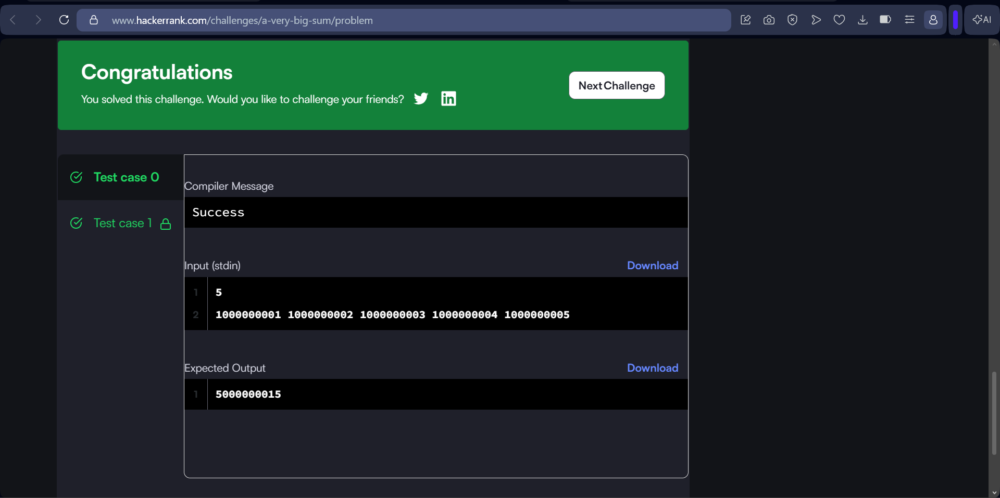

## 8. Plus Minus

The problem requires calculating the proportions of positive, negative, and zero values present in an array.

Implementation: Java 8

Approach:
The array is traversed once while maintaining separate counters for positive values, negative values, and zeros. Each count is divided by the total number of elements to calculate the required proportions.

Time Complexity: O(N)

Space Complexity: O(1)

HackerRank:
https://www.hackerrank.com/challenges/plus-minus/problem

Submission Screenshot:

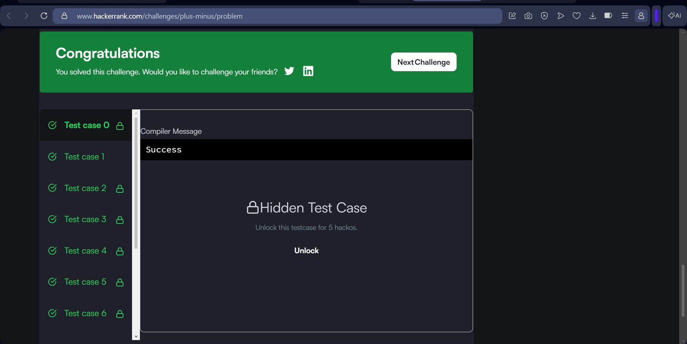

## 9. Staircase

The problem requires printing a right-aligned staircase pattern with a specified height.

Implementation: Java 8

Approach:
Nested loops are used to generate each row of the staircase. The required number of spaces is printed first, followed by the required number of hash characters.

Time Complexity: O(N²)

Space Complexity: O(1)

HackerRank:
https://www.hackerrank.com/challenges/staircase/problem

Submission Screenshot:

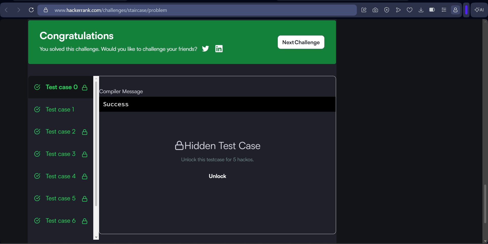

## 10. Mini-Max Sum

The problem requires finding the minimum and maximum sums that can be obtained by summing exactly four out of five given integers.

Implementation: Java 8

Approach:
The total sum of all five values is calculated. The minimum sum is obtained by subtracting the largest value from the total, while the maximum sum is obtained by subtracting the smallest value.

Time Complexity: O(N)

Space Complexity: O(1)

HackerRank:
https://www.hackerrank.com/challenges/mini-max-sum/problem

Submission Screenshot:

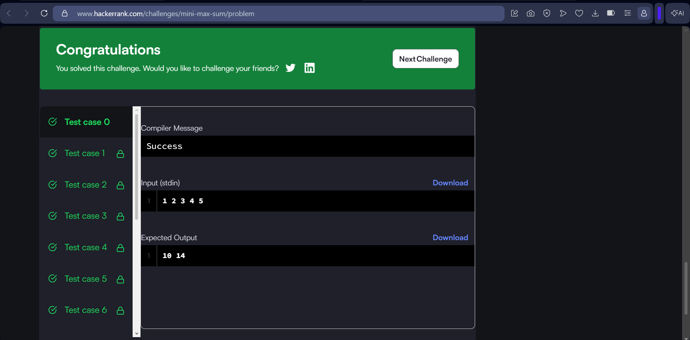

## 11. Birthday Cake Candles

The problem requires determining how many candles have the maximum height.

Implementation: Java 8

Approach:
The array is traversed while maintaining the maximum candle height and a counter for the number of candles having that height. When a new maximum is found, the counter is reset.

Time Complexity: O(N)

Space Complexity: O(1)

HackerRank:
https://www.hackerrank.com/challenges/birthday-cake-candles/problem

Submission Screenshot:

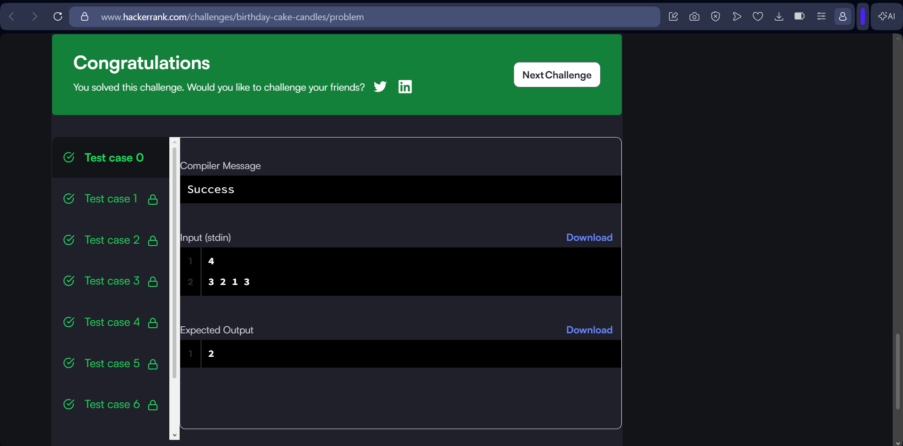

## 12. Grading Students

The problem requires modifying student grades according to the specified rounding rules.

Implementation: Java 8

Approach:
Each grade is examined individually. Grades below the passing threshold remain unchanged. For eligible grades, the difference between the grade and the next multiple of five is checked. The grade is rounded when the difference satisfies the required condition.

Time Complexity: O(N)

Space Complexity: O(1)

HackerRank:
https://www.hackerrank.com/challenges/grading/problem

Submission Screenshot:

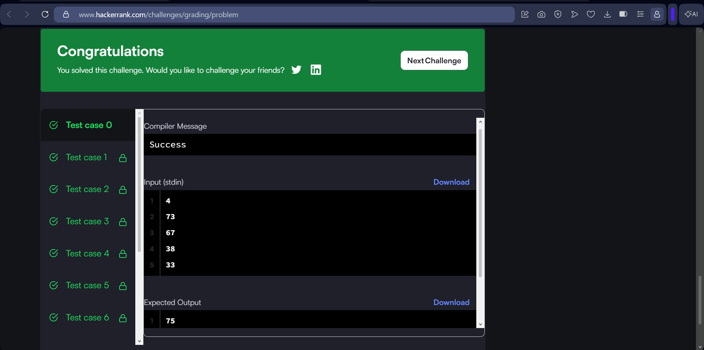

## 13. Kangaroo

The problem determines whether two kangaroos starting at different positions and moving at different jump rates can land at the same location at the same time.

Implementation: Java 8

Approach:
The initial positions and jump distances are compared mathematically. The problem can be reduced to determining whether there is a non-negative integer number of jumps that results in both kangaroos reaching the same position simultaneously.

Time Complexity: O(1)

Space Complexity: O(1)

HackerRank:
https://www.hackerrank.com/challenges/kangaroo/problem

Submission Screenshot:

## 14. Breaking the Records

The problem requires counting how many times a player breaks their highest and lowest scoring records during a season.

Implementation: Java 8

Approach:
The scores are processed sequentially. The current highest and lowest scores are maintained. Whenever a score exceeds the highest score or falls below the lowest score, the corresponding record counter is increased.

Time Complexity: O(N)

Space Complexity: O(1)

HackerRank:
https://www.hackerrank.com/challenges/breaking-best-and-worst-records/problem

Submission Screenshot:

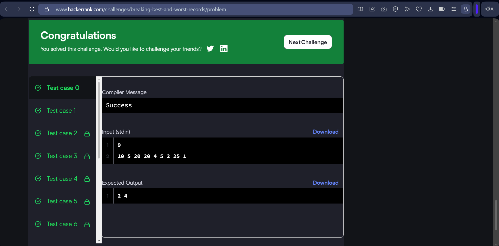

## 15. Apple and Orange

The problem requires determining how many apples and oranges land within the boundaries of a house.

Implementation: Java 8

Approach:
For each fruit, its landing position is calculated by adding its distance from the tree to the tree's position. The resulting position is checked against the left and right boundaries of the house.

Time Complexity: O(A + O)

Space Complexity: O(1)

HackerRank:
https://www.hackerrank.com/challenges/apple-and-orange/problem

Submission Screenshot:

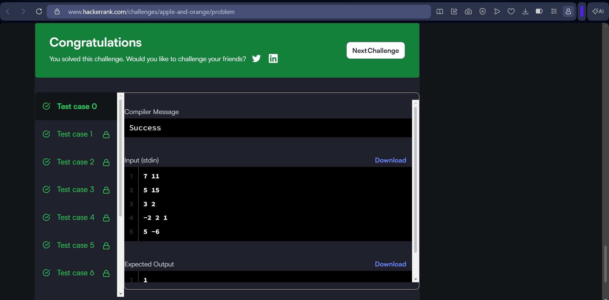

## 16. Migratory Birds

The problem requires finding the bird type that occurs most frequently in the given list. If multiple types have the same highest frequency, the smallest type number is selected.

Implementation: Java 8

Approach:
The frequency of each bird type is counted while processing the array. The type with the highest frequency is selected, with the smaller type number being preferred when frequencies are equal.

Time Complexity: O(N)

Space Complexity: O(K)

HackerRank:
https://www.hackerrank.com/challenges/migratory-birds/problem

Submission Screenshot:

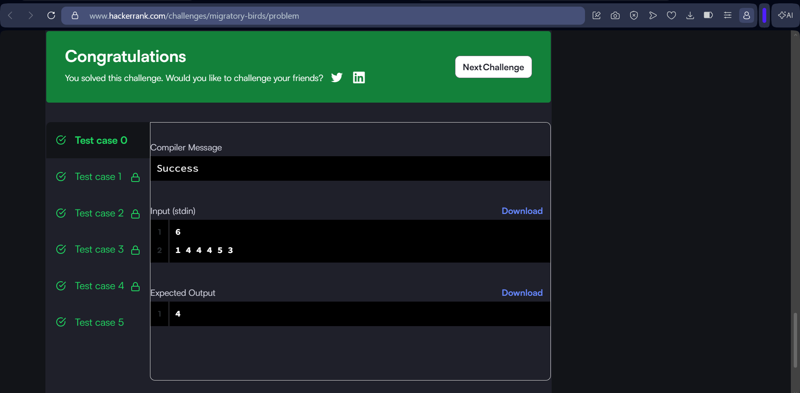

## 17. Solve Me First

The problem requires calculating the sum of two integers.

Implementation: Java 8

Approach:
The two input integers are read and added together. The resulting value is returned as the answer.

Time Complexity: O(1)

Space Complexity: O(1)

HackerRank:
https://www.hackerrank.com/challenges/solve-me-first/problem

Submission Screenshot:

## 18. Sales by Match

The problem requires determining the number of matching pairs of socks in a pile.

Implementation: Java 8

Approach:
The frequency of each sock colour is tracked. Whenever two socks of the same colour are available, they form one pair. The total number of pairs is calculated from the frequencies.

Time Complexity: O(N)

Space Complexity: O(K)

HackerRank:
https://www.hackerrank.com/challenges/sock-merchant/problem

Submission Screenshot:

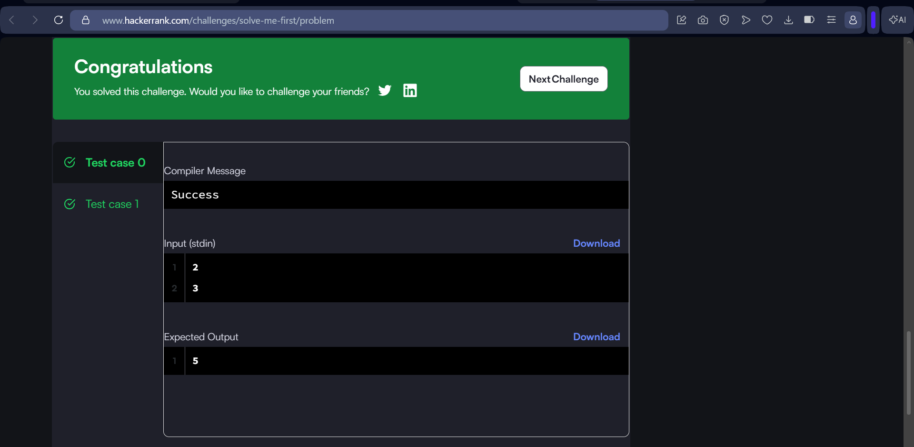

## 19. Cut the Sticks

The problem requires repeatedly cutting the sticks by the length of the shortest remaining stick and reporting the number of sticks before each cut.

Implementation: Java 8

Approach:
The shortest remaining stick length is identified. All sticks are reduced by that length, and sticks that reach zero are removed. The process continues until no sticks remain.

Time Complexity: O(N²)

Space Complexity: O(N)

HackerRank:
https://www.hackerrank.com/challenges/cut-the-sticks/problem

Submission Screenshot:

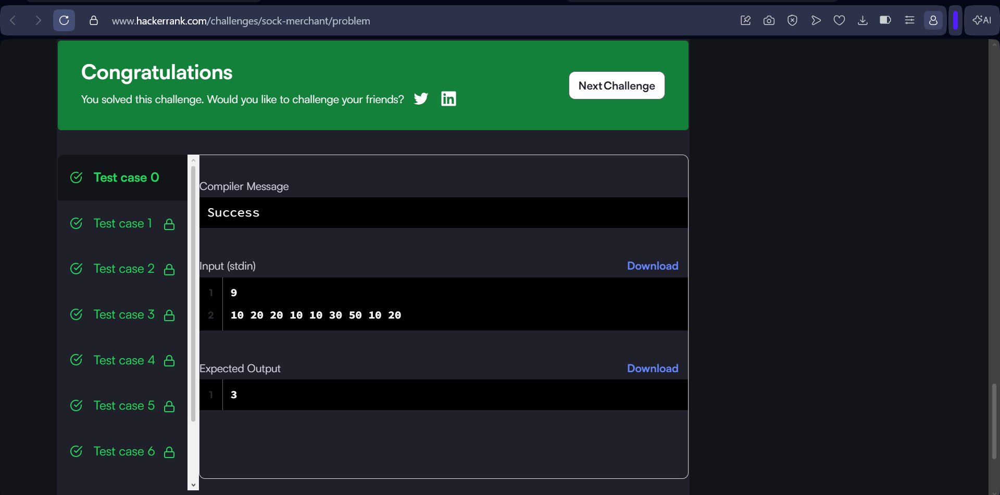

## 20. Additional HackerRank Practice

This screenshot documents the additional HackerRank problem included as HR20.

Implementation: Java 8

Approach:
The screenshot provides evidence of the accepted HackerRank submission and forms part of the additional problem-solving practice completed for this portfolio.

Time Complexity: Not documented

Space Complexity: Not documented

Submission Screenshot:

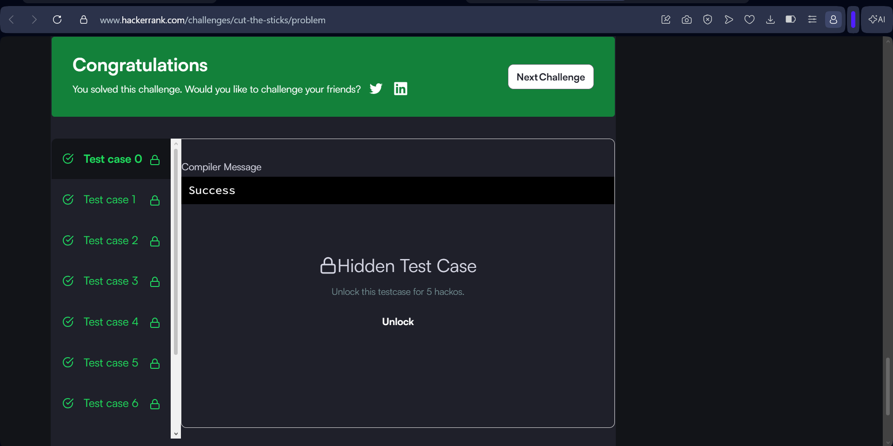

# Additional Practice Summary

| No. | Problem | Screenshot |
|---|---|---|
| 6 | Simple Array Sum | HR6.png |
| 7 | A Very Big Sum | HR7.png |
| 8 | Plus Minus | HR8.png |
| 9 | Staircase | HR9.png |
| 10 | Mini-Max Sum | HR10.png |
| 11 | Birthday Cake Candles | HR11.png |
| 12 | Grading Students | HR12.png |
| 13 | Kangaroo | HR13.png |
| 14 | Breaking the Records | HR14.png |
| 15 | Apple and Orange | HR15.png |
| 16 | Migratory Birds | HR16.png |
| 17 | Solve Me First | HR17.png |
| 18 | Sales by Match | HR18.png |
| 19 | Cut the Sticks | HR19.png |
| 20 | Additional HackerRank Practice | HR20.png |

# Key Algorithmic Techniques

The problems in this portfolio provided practice with several fundamental programming and algorithmic techniques.

1. Array traversal

2. Matrix traversal

3. String manipulation

4. Conditional statements

5. Frequency counting

6. HashMap-based data structures

7. Dynamic arrays

8. Query processing

9. Mathematical calculations

10. Pattern printing

11. Input and output handling

12. Time complexity analysis

13. Space complexity analysis

14. Algorithm optimisation

# Learning Outcome

Through this activity, I developed a more systematic approach to algorithmic problem solving.

I learned to analyse problem requirements, identify suitable algorithms and data structures, implement solutions using Java, test solutions against different cases, and evaluate their time and space complexity.

The mandatory problems provided practice with arrays, matrices, strings, dynamic arrays, and frequency-based searching. The additional HackerRank problems provided further practice with mathematical reasoning, array manipulation, frequency counting, conditional logic, pattern generation, and iterative processing.

The activity also reinforced the importance of considering computational complexity while designing a solution. Instead of focusing only on obtaining the correct output, I learned to consider how efficiently a solution performs as the input size increases.

Overall, this portfolio helped strengthen my Java programming, algorithmic thinking, debugging, optimisation, and competitive programming skills.

# Portfolio Objectives

This portfolio demonstrates:

- Practical algorithmic problem-solving skills
- Java 8 programming ability
- Understanding of time and space complexity
- Practical use of arrays and data structures
- HackerRank problem-solving practice
- Efficient algorithm implementation
- Proper GitHub project organisation
- Consistent programming practice

# Author

B.Tech Computer Science and Engineering - 3rd Semester

GitHub:
https://github.com/omsai2k7-wq/HackerRank-3rdSem-Portfolio

HackerRank:
https://www.hackerrank.com/profile/omsai2k7
